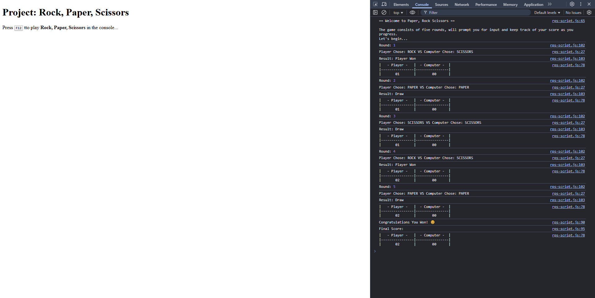

# Project: Rock, Paper, Scissors

Use JavaScript to create a game of **Rock, Paper, Scissors** that is played entirely in the browser console.

Completed as part of the **JavaScript Basics** section of the **Foundation Course** at
[TheOdinProject](https://www.theodinproject.com).

---

## Assignment Instructions

The [task description](https://www.theodinproject.com/lessons/foundations-rock-paper-scissors) includes a detailed
sequence of steps. Rather than strict adherence, the applied methodology will be to attempt to work independently toward
a solution.

However, of note are the following sections:

<ul>
<li>

in **Step 3: Write the logic to get the human choice** -

> - Use the prompt method to get the user’s input.
> - You do not need to handle re-prompting if the user enters an invalid input ... just assume the user will always enter a valid choice.

</li>
 
<li>

in **Step 4: Declare the players score variables** -

> The game will keep track of the players score.

</li>
 
<li>

in **Step 6: Write the logic to play the entire game** -

> The game will play 5 rounds.

</li>
 
<li>

at the end in a separate section -

> [!WARNING]
> When making interactive projects, like this one, you might be tempted to add more features, improve interactivity, user experience, design and styling of your website, and so on. We recommend not doing that, and saving this effort for your portfolio projects.

</li>
</ul>

## Results

*coming soon*
<!--  -->
