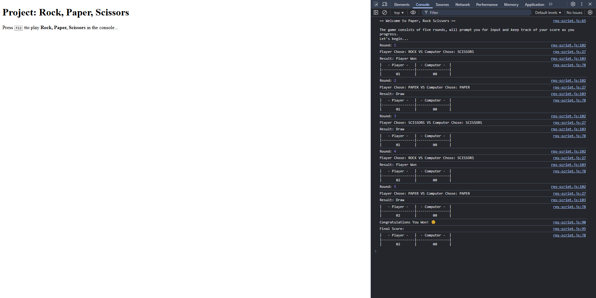

# Revisiting Rock, Paper, Scissors

Use git branching and DOM manipulation to update the original game with a UI.

Completed as part of the **JavaScript Basics** section of the **Foundation Course** at
[TheOdinProject](https://www.theodinproject.com).

---

## Assignment Instructions

The [task description](https://www.theodinproject.com/lessons/foundations-revisiting-rock-paper-scissors) includes a detailed
sequence of steps. Rather than strict adherence, the applied methodology will be to attempt to work independently toward
a solution while leveraging git branches.

## Results

*coming soon*

<!-- Final page can be viewed live [here &rArr;](https://odinprojectassignmentsbypw80.github.io/javascript-basics_project-rps/).

 -->
